**Norway from cabin to cabin.**

## I. Prelude: Zurich to Oslo

I arrive in Oslo quite late, after inclement weather in Zurich delayed a series of flights and pushed first the arrival of our plane and then our take-off slot. I opt for the more expensive airport train over the regular regional train, which is currently a bus, because I think it will save me half an hour. After buying my ticket, I am promptly ushered to… a bus. It's a little past midnight as we make our way to the city center, but there's still some last bits of daylight.

Hotels here are expensive and I'm off again the next day, so I booked a place called "city box", which turns out to be very aptly named. I seem to have gone for one of the smaller boxes. The next day, I need to reorganize my luggage (I brought a second bag I'm going to store in Oslo, because I'm spending a few days in Copenhagen after this leg of the trip), buy some snacks, and pick up a paper map. I generally trust my phone and have a powerbank, but for a country where even the most remote place still takes Apple Pay, people here seem unusually insistent on carrying a paper map as a backup. I'd also like one as a souvenir anyway (I like maps, and I like the design of what seems to be [the go-to option](https://calazomaps.com/collections/jotunheimen/products/turkart-jotunheimen-1-50-000)).

## II. Oslo to Gjendesheim

Coming out of Oslo, the views are nice enough. The landscapes are extremely lush and green, "what a pretty country" I think to myself. Then, after about three hours, we gain some altitude, and I'm absolutely floored. I can't stop staring out the window in complete awe. I am of course no stranger to impressive mountain views back home in Switzerland (a fact that comes up at the dinner table more than once during my trip). This, however, feels completely different (which is usually the next thing I say).

I'm surprised how alpine everything looks given my entire trip stays more or less between 1000 and 2000 meters above sea level. This far north, the tree line is about 1000 meters lower than back home, so everything is a lot more barren. But the bigger difference is the sheer expansiveness. It's rare to see off to the horizon without facing another mountain in Switzerland, and most valleys are narrow and steep. Here, there's nothing but the road you're on as far as you can see.

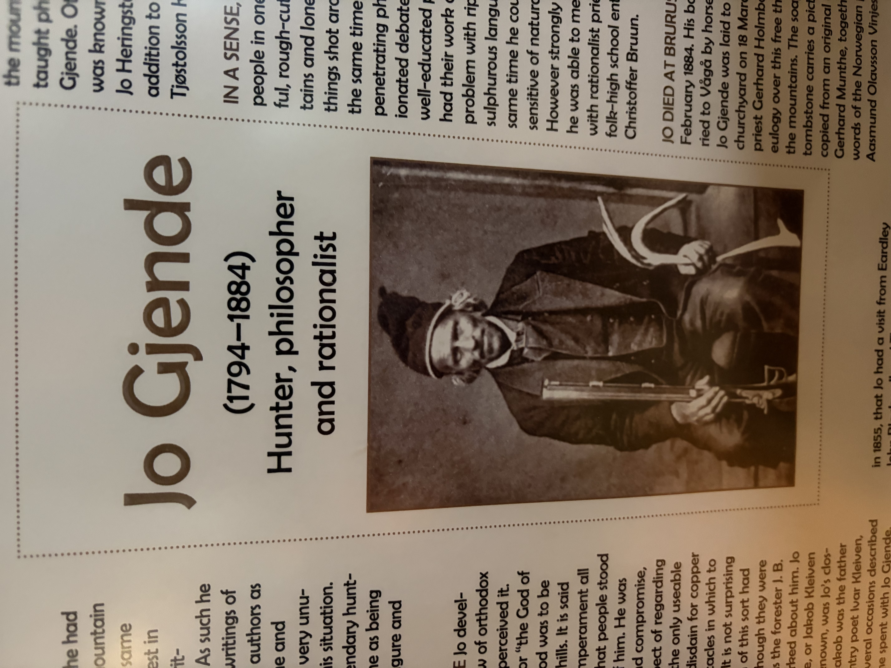
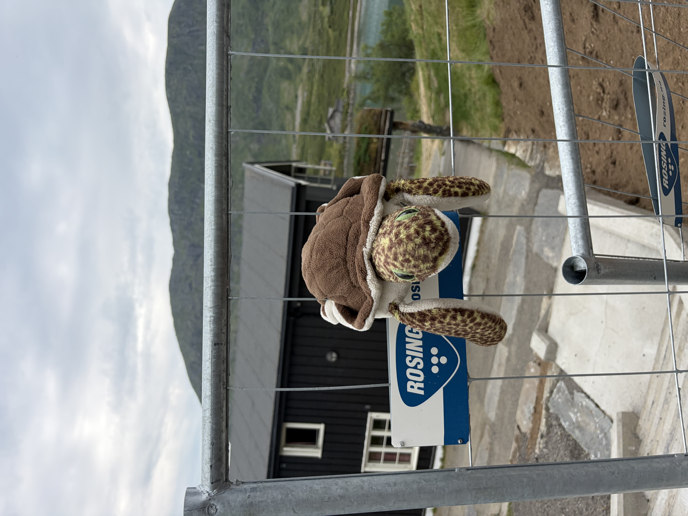

*Left: Jo Gjende, eponym of Gjendesheim, and apparently quite the character (and forefather of LessWrong?); Right: Foreshadowing of how my legs feel after the first hike.*

The first thing that catches my eye at the reception counter of the Gjendesheim <abbr title="*Den Norske Turistforening,* the Norwegian Trekking Association">DNT</abbr> cabin is a Kindle. It dawns on me that I probably left mine on the bus earlier. A bit of frantic shuffling through my backpack confirms my suspicion. But the wear and tear on this one's cover looks eerily familiar, so I ask the receptionist whether it's hers or whether someone dropped it off there by any chance. She smirks and asks "well, did you maybe…  leave yours somewhere by accident?".

Norway [ranks near the top](https://ourworldindata.org/grapher/self-reported-trust-attitudes?tab=table) on surveys asking people whether they think strangers can be trusted. The interesting thing is that this instantly stands out to me, someone from Switzerland, a country that's famously safe and firmly in the top ten on the same ranking. 

I never got anything stolen from me back home. Over the years, lost and found has reunited me with a phone or two, a jacket, a work bag including a laptop, and a wallet (albeit without the small amount of cash that was in there when I lost it). For my first few years in Zurich, I lived in a house where for some reason nobody had a key for the front door, and our shared flat remained unlocked 24/7 because one of my roommates had lost their keys at some point and didn't want to go through the hassle of getting a new one (and possibly paying for a change of locks). Nothing bad ever happened.

I'm not sure if this is just what the extra fifteen percentage points Norway has on Switzerland in the aforementioned surveys, but something seems qualitatively different here. In Switzerland, I feel like you can trust people not to do anything bad. Here, I feel like you can trust them to actively look out for others.

Another striking example arrives a few days later as I'm heading back to Oslo on a train. Between checking tickets, the conductress is going back and forth finding space for people's luggage (often carrying the suitcases herself, and helping people find and unload them once they get off). When a mother and daughter change their compartment and leave a jacket behind, she catches this walking by fifteen minutes later, and brings it over to their new seats.

Norwegians are supposedly quite reserved. But at least while out hiking, I don't encounter this as them being overly closed off. The average encounter feels more like talking to the kind of introvert who is warm and curious towards others, but ok enough with the occasional silence or a conversation not picking up speed naturally that they don't feel the need to force anything.

Everyone here seems to be exceptionally nice, as opposed to the Swiss' more formal and guarded politeness. I don't spend enough time in Oslo at either end of my trip to get a good feeling for what it's like in the city. But at restaurants and shops, people tend to face you with a calm, settled friendliness. I also had more than one instance where someone leaned in surprisingly close when talking to me, finding myself in a sort of intercultural version of the "is the barista possibly into me or just nice because it's her job" puzzle.

My most surprisingly pleasant interaction occurred after arriving in Oslo, waiting for my bus to Gjendesheim in a secluded almost-park behind the bus terminal. A drug dealer approached me to ask whether I was interested in buying some hashish. My initial confusion and subsequent laughing refusal were met with a warm smile, a very polite "...no?", and him walking away cheerfully and wishing me a nice day. Maybe he was just under the influence of his own product, but it fit the general pattern.

## III. Besseggen

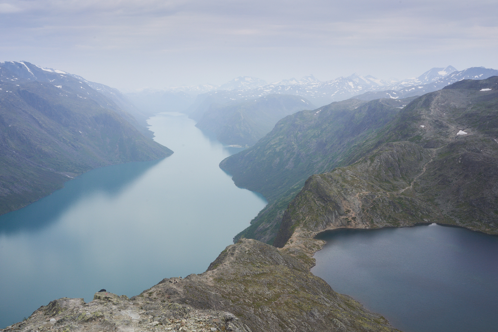

At Gjendesheim, I meet up with a friend from the US who's passing through Europe and joining for a day of hiking before heading back to Oslo. Our plan is to do what is apparently Norway's most popular hike: Besseggen.

The good thing about this compared to other very popular routes is that no matter which way you do it, you either start (the more popular variant) or end up in Memurubu, about midway along Lake Gjende. This means you need to take a boat out or back, which acts as a sort of rate limiter. So while the trails are markedly more crowded than the ones I'll spend the next few days on, you never feel like you're waiting behind a line of people trying to get an Instagram shot.

I read up on the route before. It's a somewhat long one, and the most impressive part, the ridge above Bessvatnet, is apparently quite exposed at times. When the Norwegian woman seated next to me on my flight to Oslo recounted her time hiking Besseggen, she'd made it sound like she was saving hapless tourists from falling to their certain deaths left and right. Since I've never been on a proper hike with my friend and she's also feeling slightly under the weather, I am a bit worried despite her assurances that she's fine (this conveniently allows me to ignore the fact that she is considerably more in shape than me).

I spend the better part of the first ascent monitoring how sure-footed she is, how she's doing with the onset of her mild cold, and whether she needs that extra jacket I'm carrying for colder days. 

Then we get to the tricky bit and the tables turn. At some point a third of the way up the ridge, I start having to think more and more about which line to pick. There's one bit that seems like I'll have to make an impossible stretch or work my way around a rock dangerously close to the drop, and I feel some fear starting to creep up and worry about whether it's going to get harder or easier further on. I look up and see that my friend is completely fine, has entered some sort of flow state, and is deftly climbing up the rocks at a speed that has her occasionally stop and check in on how I'm doing down there.

Above the ridge, we are greeted with a landscape that feels like Mars or the moon (judging by how my knees feel on the descent, the gravity is definitely still Earth's). The deceptively long bit until the descent proper starts, and the descent itself, are relatively unremarkable. Except for one part: Coming around a bend, we suddenly find a small snow field on which a herd of reindeer are huddled together.

Back at the cabin, I feel two things at once: My legs, and overwhelmingly alive.

## IV. Gjendesheim to Glitterheim

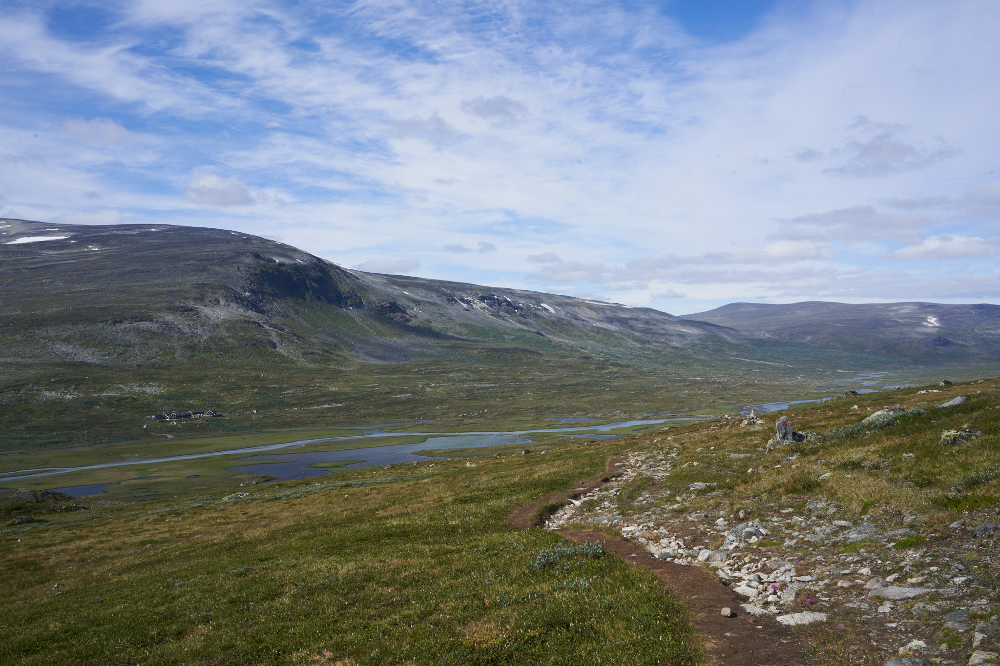

The terrain on the second day is not as daunting as Besseggen, but this time around I'm alone, I have eight hours in front of me, and my legs are noticeably tired. After the first climb, I cross a plain that is extremely cold and windy and feels quite desolate. I occasionally trade places with another hiker, but other than her I don't meet anyone going the same direction as me. Afterwards, things get considerably more comfortable (and lush) as I make my way down towards and along Russvatnet. 

Then comes the last and most tedious part: Up towards Vestre Hestlægerhøe, I get quite tired and things get extremely rocky and boring. I repeatedly lose track of the trail and end up slightly below where I'm supposed to be (I meet about five people over the next two days who asked themselves if they hadn't been paying attention or if the markings were not great around the same stretch). I slowly make my way up and cross some remaining snow at the top.

And then finally… Well, no, not really. The descent is another deceptively long stretch of rocky terrain, and it's quite the drag on my tired legs. I try rewarding myself by listening to some music, but I'm too spent to really enjoy even that. Once you reach the plain at the bottom, you're not really at the end at all either, and there's another three kilometers or so that feel like a huge detour at that point, until you can cross the river and finally reach the cabin, which you've seen promisingly appear in the distance more than once at that point.

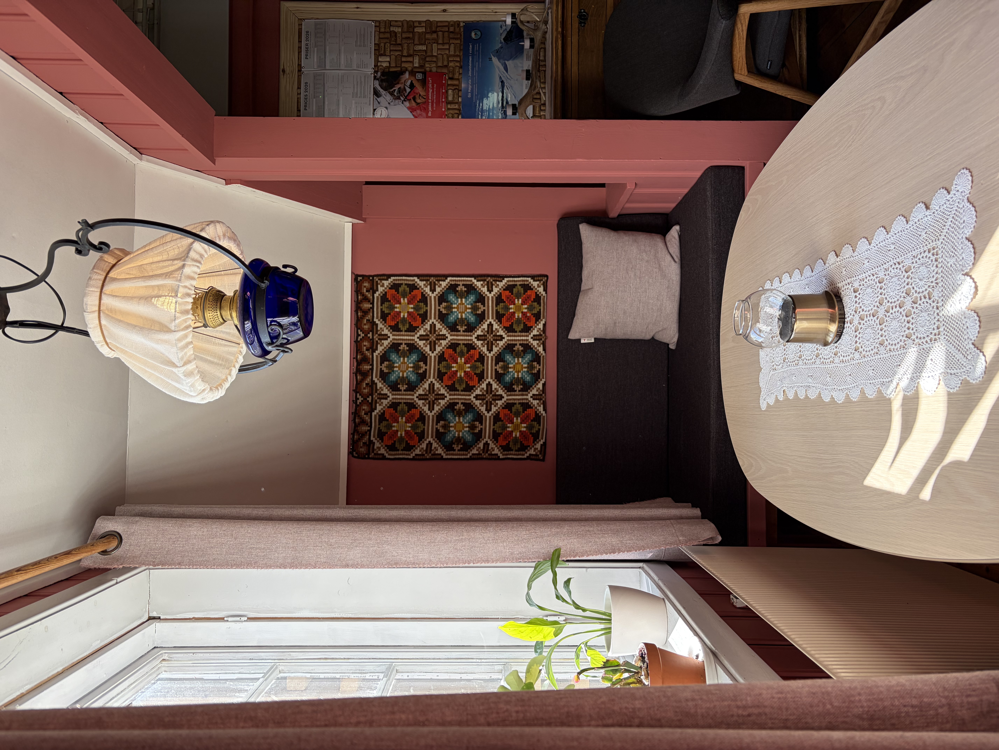
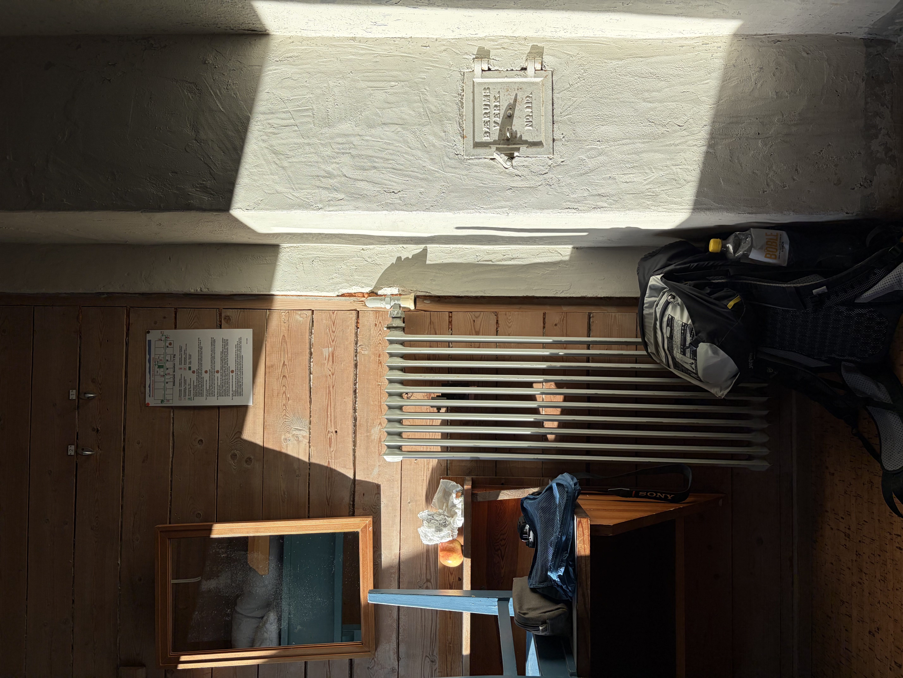

*Left: Alcove in the reception area, maybe the most [A Pattern Language](https://www.iwritewordsgood.com/apl/patterns/apl179.htm) thing I've seen in recent memory; Right: Evening light in my room.*

As far as DNT cabins go, Gjendesheim and Glitterheim are a pretty stark contrast. By virtue of its accessibility, Gjendesheim is big and quite touristy. Multiple Norwegians I meet during my trip seem to dislike that somewhat, pejoratively describing it as "like a hotel". One slightly grumpy guy says there's way too many kids running around (I don't mind those, I say, I love a lively atmosphere even way out in nature).

Glitterheim is completely off the grid. The gravel road is not open to traffic, and the closest access is a toll road that ends at a parking lot about eight kilometers from the cabin, right on the boundary of the national park. As far as I can tell, the power comes from generators running somewhere on the property.

Everything looks much older and simpler here, but it also has a cozier vibe. There were a few moments during the day when I was growing particularly weary and anticipated the remoteness would mean I was in for worse food, but it turns out I was setting myself up for an amazing surprise. I distinctly remember having a craving for some salmon during a particularly low moment. At dinner, I find myself in front of a buffet of pure abundance with three kinds (along with all sorts of other delicious things).

There is no cell signal at Glitterheim. The satellite powered WiFi is used for the reception and telephony only, and they don't hand the password out to guests.

I feel a moderate sense of withdrawal, but posting nice pictures for friends and family back home can wait. It does however pose an obstacle to writing to my friend and telling her I made it to the next cabin okay. I try viewing the network password in the system settings, which I'd feel completely fine with in most hotels but which feels weirdly illicit and like I'm defecting from some social contract here. No luck.

A fact about today's digital environment I usually don't give much thought to is that if you only have access to a third-party laptop connected to the internet, it is almost impossible to sign in anywhere. Most of my online accounts that would let me message someone require either my security key (that's currently in my city luggage back in Oslo) or an active connection on my phone to receive a two-factor code or sign-in approval notification. I dig through my memory and my password manager for some long-forgotten hosting provider email account or such with weaker security, but I can't find anything and give up.

## V. Glitterheim to Spiterstulen

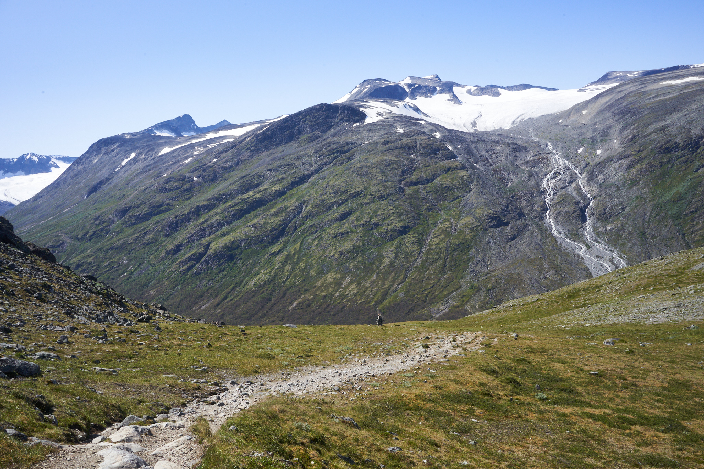

After the struggle of the previous day, I'm a bit worried about this one, but my legs feel alright and it turns out easier than expected except for a very steep descent towards the end.

I overtake an American family on the first climb, or rather the two parents, as their daughter is way ahead at the top and waiting for them, a pattern that will repeat a few more times today (she later tells me she's allowed to go as far ahead as she wants to, so long as she waits for them at the next signpost, "that's the one rule").

I join up with them and a Dutch woman who turns out to be the one hiker I met going the same way the previous day. Eventually I walk ahead alone again (I only manage to overtake the Americans' daughter thanks to a signpost).

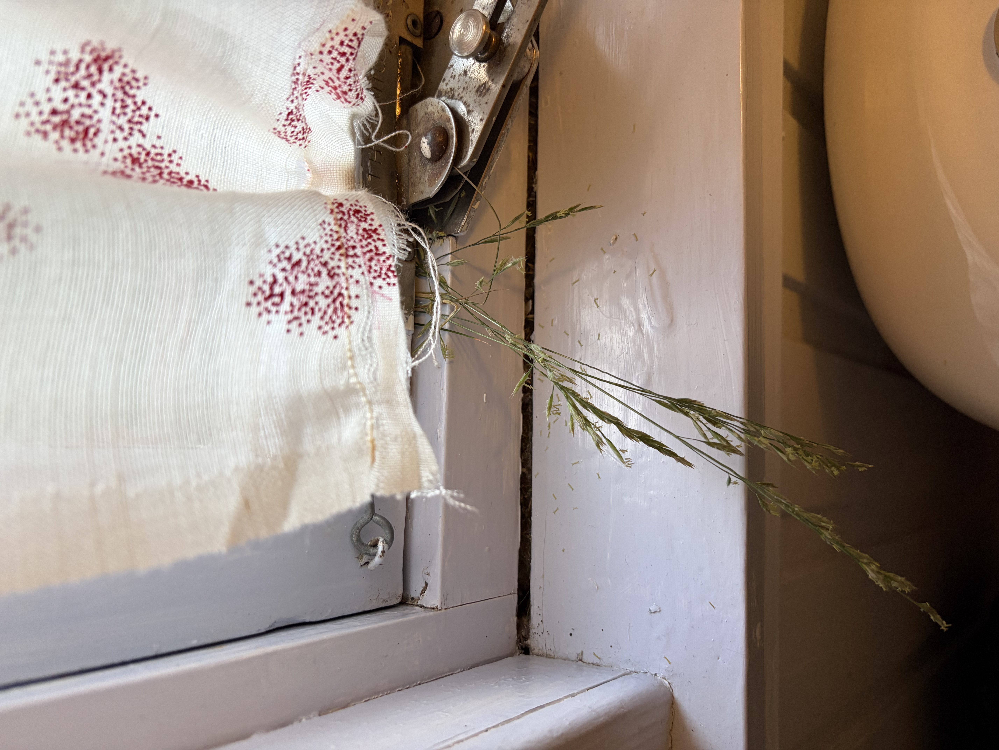
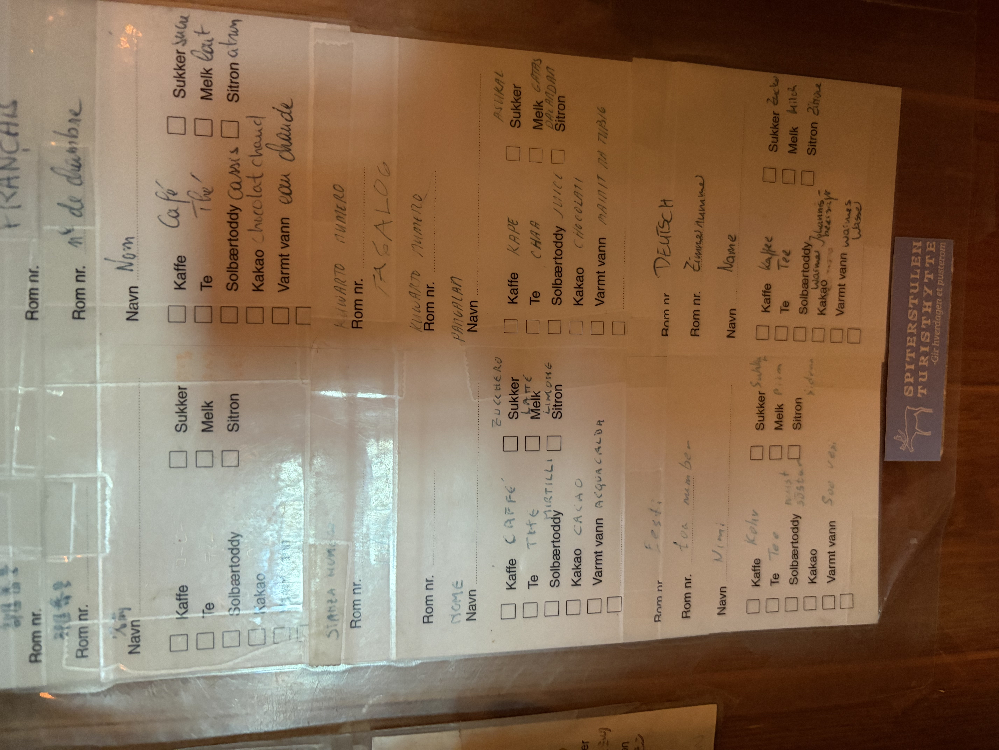

*Left: Nature trying to make its way back into the rigidly managed domain of Spiterstulen Turisthytte by way of a bathroom window; Right: To fill your thermos, please properly follow proper protocol (language barrier will not be admitted as an excuse for failure to comply).*

The DNT is a bit of a national treasure, and the outdoorsy Norwegians I meet along the way all treat it with a certain reverence. I appreciated it from the first night in Gjendesheim, but the best illustration of how much of a treasure it is arrives by counterexample at the end of my third day of hiking.

After the steep descent to Spiterstulen, I am rewarded with an unusual surface on the home stretch: An asphalt road. Unlike Glitterheim, which is multiple kilometers from the next parking lot, this place is reachable by car, which already feels a little alien at this point.

Walking onto the premises, the best way to describe my first impression is that it feels oddly *American*. Old cars on the lot, dark wood exterior, the sign marking the drying room reminding everyone that it's only for registered guests, and only active from 7.00am to 11.00pm. The huge lobby area I enter to check in cements the impression. This feels like a lodge I stayed at near one of the canyons in the US once.

The DNT's passionate hosts usually hold a short speech (and crack the exact same jokes) at dinner every night. The guy running Glitterheim, the previous cabin, is apparently of the fifth generation in his family to do so. Supporting staff are often volunteers and young people doing this as a summer job.

When I later spend a few days in Copenhagen, a researcher doing surveys for the city approaches me to ask about my experience of its public spaces. One of the questions is whether the greenery makes me feel like I can "experience nature", to which I half-jokingly reply that that's a bit of a stretch after my time in Jotunheimen before coming here. He perks up and starts reminiscing about working at DNT huts during summers while studying, earning little but getting to have an amazing time with "friends and girlfriends" (I don't inquire about the latter part). He wistfully says that he's "glad to hear the mountains are still standing" and that he should go back there. It takes him a few seconds to remember he was in the middle of interviewing me about the city square we're sitting in.

The staff at Spiterstulen has a distinctly different vibe. Here, you don't get people who found a way to spend their summer in nature, you get people who are working a regular hospitality job. Anyone who's tried that will know it's a lot less fun, and you can tell from the general atmosphere. Their demeanor and uniform says "someone briefed us on making a good impression on our guests and is keeping an eye on it", which (unsurprisingly) ends up making much less of a good impression on me than the casual and authentic good time the people at DNT cabins are having.

Everything is a bit more formal here. Checking in? We'll just need a passport or id from you please (my name was sufficient at even the busiest DNT cabins). Want to fill up your thermos with coffee or tea? Please fill in this small order form, stick it to your thermos, and deposit it on the shelf over there no later than 11pm (at DNT you just do this yourself at the breakfast buffet). The form does not let me specify which kind of tea, and when I pick it up the next morning the single nondescript bag of black tea has been steeping for a period of time approaching Liz Truss' tenure as prime minister. Packed lunch is limited to four slices of bread. I half expect that I will have to request said slices from staff after leaving the dining room so they can count them out, but in a pleasant surprise there is no enforcement on this point.

Much like the casual atmosphere at DNT, all of this is somewhat infectious: For the first time since Oslo, it occurs to me that I might want to lock my room because I have my camera and wallet inside.

The day after, I'm back at a DNT cabin, and me and two Norwegians talk about this. They thoroughly enjoy my observations and get visibly sentimental when we reaffirm how much we prefer it here.

## VI. Spiterstulen to Leirvassbu

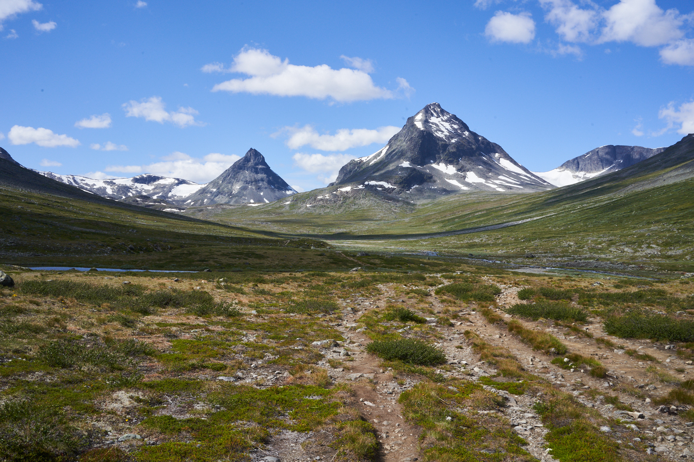

The last hike is an easy one. Along a green valley from Spiterstulen, then up maybe 200–300 meters or so of elevation, then  across some comfortably spaced rocks along a small lake between Kyrkja and Tverbytthornet.

I spend most of the day walking with a German kid I met at dinner the night before. He just graduated high school, is going to join the military and then train as a police officer, and is currently solo trekking in Norway for multiple weeks, carrying his tent and all his food on his back (~25kg after resupplying, he told us last night). I find this so cool I feel an almost paternal sense of vicarious pride. As we talk about what he and his classmates think about the world and what they worry about politically, I wonder if I was anything close to equally thoughtful and reasonable him back then. The kids are all right.

I eat my lunch that day sitting on a small hill, looking across the valley and the river flowing through it. It occurs to me that I'll have memories and pictures but probably won't be able to fully recall the sheer sense of awe that being surrounded by all this inspires once I'm back in the city.

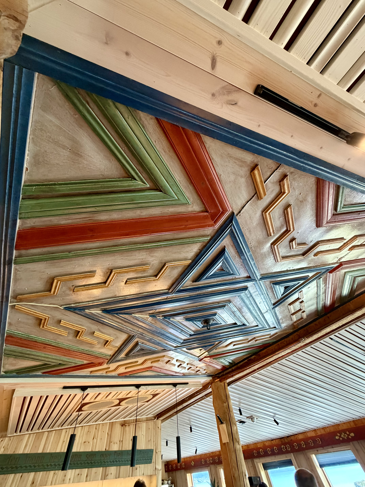
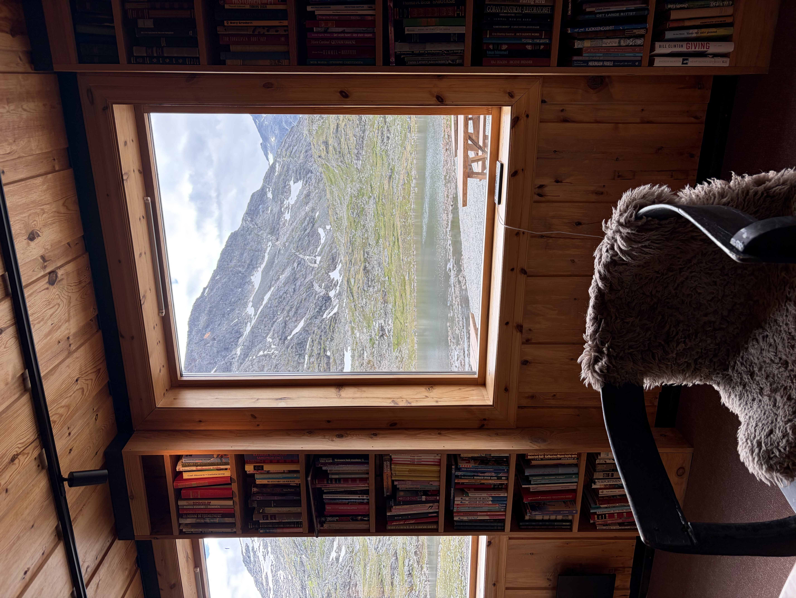

*Left: The extremely cool ceiling in the dining area; Right: The extremely cozy lounge area.*

Back on my first evening at Gjendesheim, me and my roommate were seated with a Danish-Norwegian couple, who summarized the difference between the two countries as such: "The ideal for a Norwegian is a secluded hut in the middle of nowhere, complete isolation. The Danes on the other hand *\[imagine hand gesture indicating compaction\]*, they all want to bunch together". My impression after four days is that while Norwegians might enjoy a solitary hut in the middle of nowhere, they would probably delight in welcoming strangers passing by rather than picking up their pitchforks ready to defend their property.

In general, hiking on the DNT network sits at an interesting spot between individualism and collectivism. On many trails, you can walk for hours not really seeing anyone else. But everyone you do encounter is an instant friend, at least for a while (it happens to me a lot that I spend a couple hours talking to someone before exchanging names, if we ever get around to it at all). There's obviously some camaraderie that naturally comes with sharing a remote cabin with strangers, but it's also actively cultivated. Everyone has dinner together, strictly on time, and before your seating you line up and get assigned a spot somewhere. The food comes out family-style in large bowls and on large plates that you share out among the table.

Except for one night where everyone speaks German (at Spiterstulen — I almost wonder if they deliberately arranged that in a grave misunderstanding of what travelers are usually looking for), most dinner conversations happen in English. Over the meal at Leirvassbu, me and my tablemates get to talking about the Norwegian language, or rather the Norwegian languages. 

I was vaguely aware of Norway having two different "Norwegians" as an official language before, but I never properly looked into how they differed. The straightforward case is Bokmål (literally "book tongue"), which is basically a slightly more Norwegian Danish and the more commonly used between the two. 

The second one is a bit weirder: Nynorsk ("new Norwegian") was officially adopted in the late 19th Century. It came out of a project by a young philologist who travelled the countryside trying to gather how people spoke and assemble the dialects that weren't as influenced by Danish into their own standardized language.

So far so good, but apparently in the 20th Century, political attempts were made to have the two official languages drift together in order to eventually merge them into one, while simultaneously wanting to allow more flexibility for people to stay closer to their spoken dialects along the way. This created a lot of officially permissible variation in the language, introducing alternative words and word endings that were not normally used in official communications or textbooks, but considered correct in student writing or private correspondence. The result has apparently turned out somewhat confusing — not just for the Dutch guy next to me who had tried to learn it when he spent a year or two at a Norwegian university, but also for all the Norwegians at the table that night.

I haven't read up on this too deeply (there's a Wikipedia article ominously titled ["Norwegian language conflict"](https://en.wikipedia.org/wiki/Norwegian_language_conflict)), but the whole thing seems like an oddly deliberate attempt at planning out and managing language, on a grander scale than the French having a committee making up new words to avoid having to say "Computer". Then again, I hear Norwegians like properly planning things.

The friend I met up with in Gjendesheim (who is one of the more chaotic people I know) told me how she overheard a border agent quizzing the person in front of her. When the traveller responded that they didn't have their trip fully planned out, the border agent apparently responded "when you are coming to Norway, you must have a plan".

Maybe that overstates the Norwegian's desire for preparedness (border guards on duty are rarely too representative of the general population), or maybe the DNT trails are one of the few places where they let themselves be a bit more carpe diem (while making sure they carry a paper map to be sure, etc.). Maybe it's also just that everything here is so well organized that the system supports a reasonable amount of spontaneity, and everyone makes sure to only use that liberty a reasonable amount.

On my last night at dinner, I talk to a middle-aged Norwegian guy who tells me the next time I shouldn't pre-book anything — "Just fly to Oslo and check the weather. They always find a space for you to sleep in the cabins". Indeed the bigger huts get busy, but after the first night I never shared a room with anyone even though I always opted for a bed in a two-person bunk.

He doesn't have a set timeline for his hiking break, he's heading back home to his wife and daughter whenever he feels like he's done with the mountains. I wish I had that liberty too, but for me it's back to Oslo tomorrow.

## VII. Coda

Before this trip, most of my travel had been to cities, where you essentially have to prepare nothing. What you forget (if anything) you can buy somewhere at most hours and without planning ahead. Hiking is different: You should know your route roughly, be ready for all sorts of weather lest you get stuck (or completely soaked) by a day of rain. The DNT makes the logistics relatively easy by having a central booking website, good online trail maps and tour info, and most of all (in my case, staying at serviced cabins) by taking care of food for you. Still, you need to think ahead a bit more than when you go to London or New York.

But once you set off, this inverts as you get into a nice routine. Because my route was set, and the endpoints were individual cabins surrounded by nature, most days required almost zero decisions. 

There's something weirdly zen about this. You get up more or less in time and start walking. If it's cold you walk in the cold, if it's warm you walk in the warmth, if you're feeling great you walk fast, if you're getting tired you walk slowly. Once you're at the next stop, you have a beer, shower, and hang your clothes to dry. Dinner arrives without having checked a single review on the internet, and then it's preparing your things and early to bed in order to recover for the next day. You already know what's on the program for tomorrow, so that's taken care of too.

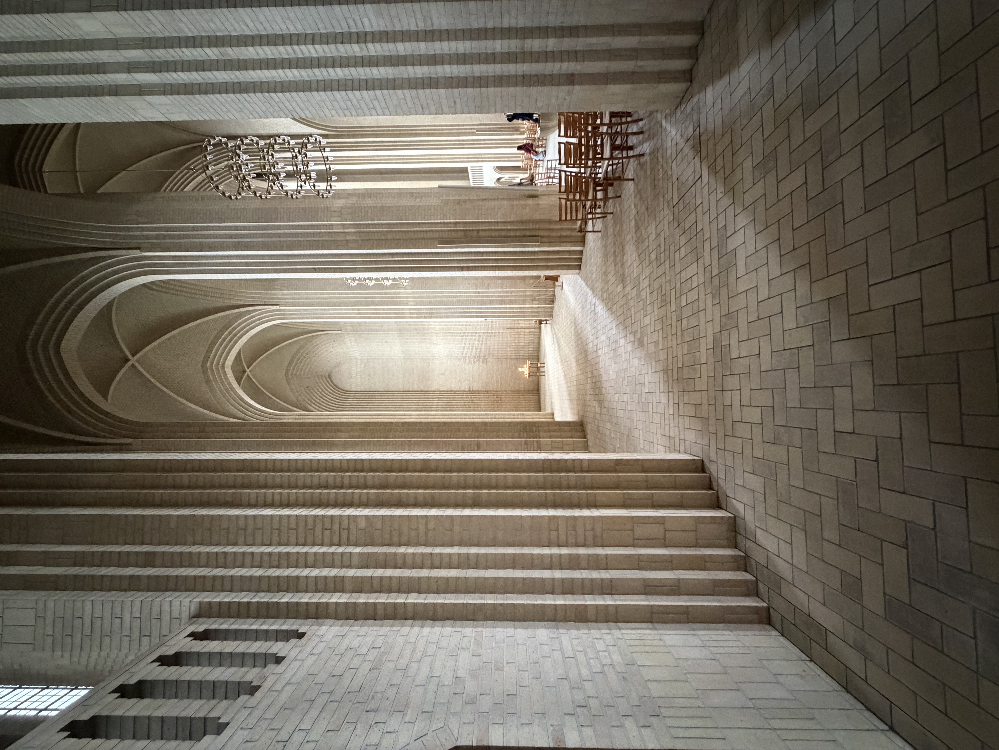
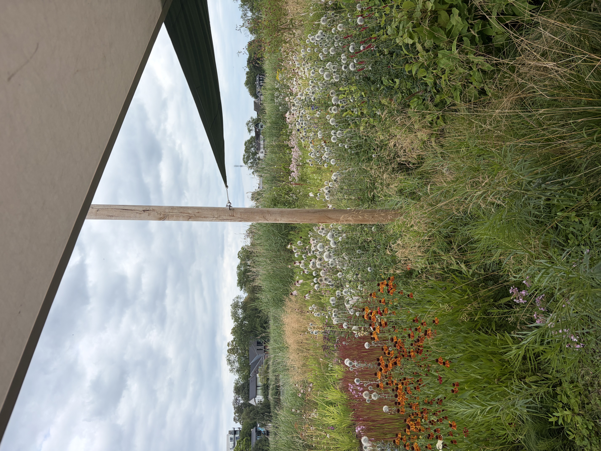

*Left: Grundtvig's church; Right: The gardens at Noma*

Arriving in Copenhagen, it takes a day or two for me to switch my decision-making faculties back on and start enjoying all the variety that's on offer. My first night, I reluctantly pick a highly rated restaurant on Google Maps and then go to the cinema to watch The Odyssey for lack of other ideas and wanting some passive entertainment.
